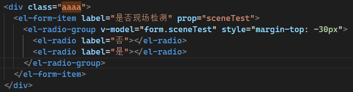

# 概述

这里记录一下工作中遇到的令人迷惑的事

## 复杂的样式污染

那是一个阳光明媚的午后，我接到一条平平无奇的需求，**把输入框和底下提示的间距调一下**

---

---

我的内心毫无波澜，打开 VSCode，稍微感到了一丝不对劲

---

---

class 名称居然是 aaaa，这比我之前遇到的 aa 还要强大一个等级啊，还有行内样式，呵，看来这次的需求不简单啊，我打开控制台准备大干一场，按下F12，瞬间控制台上一连串的符咒好似魔法一般闪的我睁不开眼

---

---

> 这里没有截完，下面都是这样的

什么！？居然是覆盖组件样式，还是多重的，真是可怕，写下这代码的人功力真是深厚，我眉头微微一皱，暗道不简单，首先这是覆盖了el-form-item__content的样式，那么这个页面上所有的el-form-item都将会受到影响，最坏的情况下，此人如果不使用scoped关键字，这样的覆盖将会扩散到全局，也就是整个项目的表单都会受到影响，
但是没关系，这个需求应当只需要修改el-form-item__error的样式即可，我的鼠标缓缓移向红色的错误提示，然后点击

---

---

瞬间，大量的!important进入我的意识，可恶，快处理不过来了，我拿起水杯喝了一口水，嘶，真是恐怖如斯，在这平平无奇之地，居然有人能布下这样的禁制，真是大意了，我总算回过神来，开始研究这段样式，啧啧啧，真是天才，天才啊，这世间竟有如此奇人，不光光重现了之前的多重样式覆盖，竟然还加上了!important这样的陷阱，可恶，现在我要开始认真了，等等，我方才竟然忽略了一件事，只有display不为inherit的才可以设置top属性，难道他，难道他竟将表单元素设置为了绝对定位，啧啧，用天才已经难以形容这种人物了，简直是绝世鬼才

我冷静了一下，理清思路，首先我们需要取消绝对定位，因为这会影响element自身的样式，然后将奇奇怪怪的属性全部去掉，是的就是这么简单，element本身就以简洁闻名，只需要少量设置，就能达到很不错的效果。但有一点致命问题，这样式也牵涉到其他的页面，修改一个的同时很有可能触动到其他页面

---

---

果然如此，看来是有10个页面没有使用scoped导致样式全部混到一起，这样的话工作量就相当庞大了，特别是这个项目目前处于刚刚上线运行期间，此时可能会有其他更重要的需求要解决，而这个样式的修改一旦开始就没法停下，如果改到一半就停下，受影响的页面会变得一团糟，工作量完全没法预估，该死，我一世英明，竟栽在这种鬼才手中，而且，想要修改提示，势必要修改表单的高度，这又是一场恶战，并且，如果删除这该死的全局样式，不知有多少页面会受到影响，又有多少修改的工作量啊