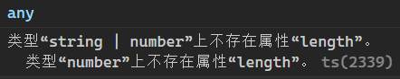

# 安装

### vite

创建项目时选择 typescript 即可

# 概述

简单说，就是强类型的 JavaScript

# 类型

下面是 JS 和 TS 声明变量的区别

```js
// JavaScript
let temp = 1

// TypeScript
let temp: number = 1
```

所有的变量都需要声明类型了，就像这样

```ts
function add(num1: number, num2: number) {
  return num1 + num2
}
```

就跟一般的 JS 一样，TS 的类型分为简单类型和复杂类型，这两种类型的名字很多，不用特意纠结，知道区别即可。

## 简单类型

```ts
// 布尔类型
let isShow: boolean = false

// 数值类型
let num: number = 0

// 字符串类型
let str: string = "name"

// 空类型
// void一般用于声明没有返回值的函数
function fun(): void {
  this.num++
}

// 别的
let v: void = null
let u: undefined = undefined
let n: null = null
```

## 任意类型

在说其他类型之前我们先说一种特殊的类型，在使用 TypeScript 的人群中，有一部分人会戏称自己使用的是 AnyScript，表示自己在声明类型时只会声明 any 类型

```ts
let anyVar: any = "any"
```

> 使用 any 类型声明的变量在运行时允许被赋值为任意类型 http://ts.xcatliu.com/basics/any.html

同时如果一个变量在声明时没有指定类型，它会默认为 any 类型，也就是说如果你在 TypeScript 中所有需要指定类型的地方使用 any 类型，那么这将和直接使用 JavaScript 没有区别

## 组合类型

这个就是字面意思，你可以为一个变量声明多个类型，只要变量的类型是其中一个即可

```ts
let strNum: string | number = "0"
```

### 组合类型的属性或方法

```ts
function getLength(temp: string | number): number {
  return temp.length
}
```

输入你输入上述代码，编辑器将会报错


所以当你使用组合类型的属性或方法时千万注意，该变量的所有类型都需要支持你使用的属性或方法

另外，联合类型的变量也会在运行时根据具体的值来变化自己的类型